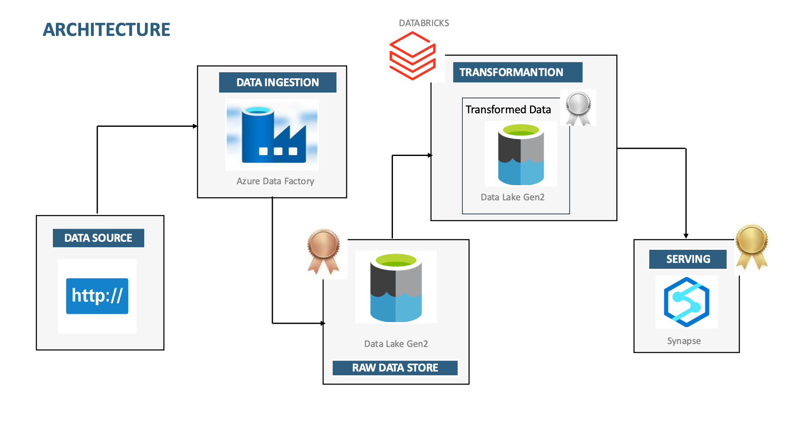
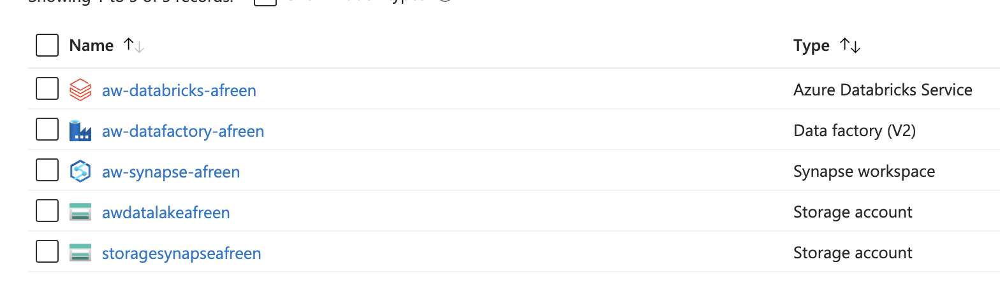
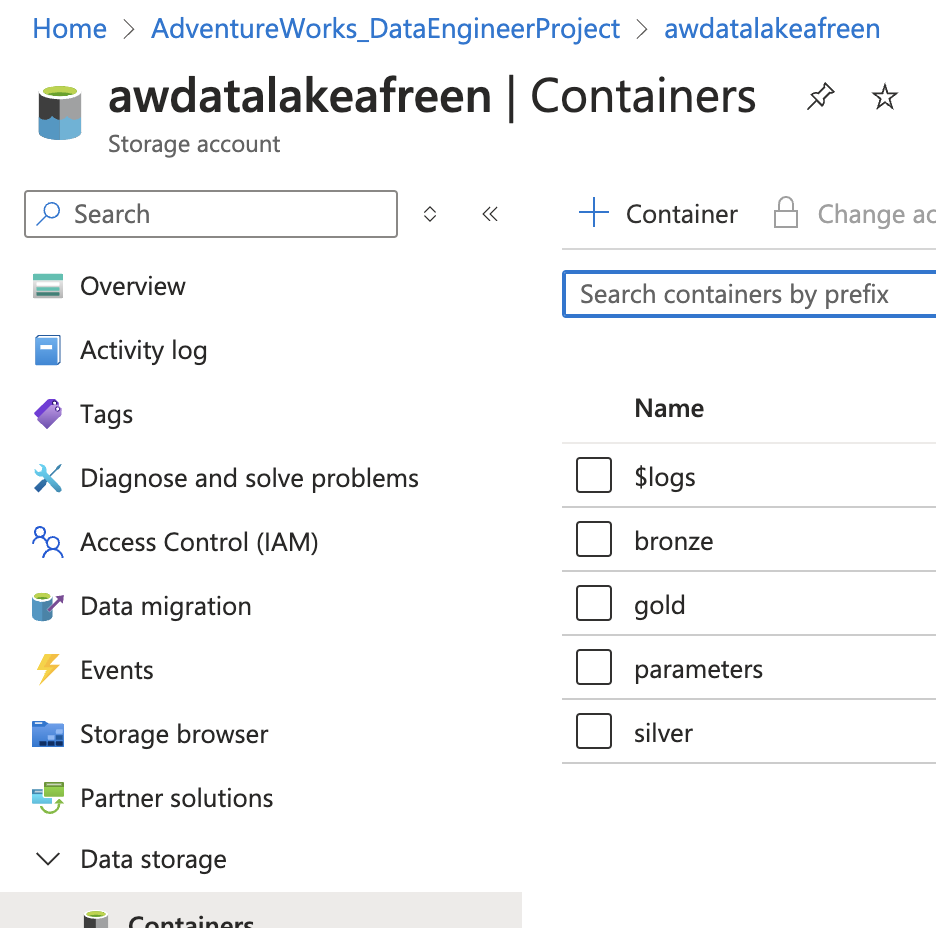
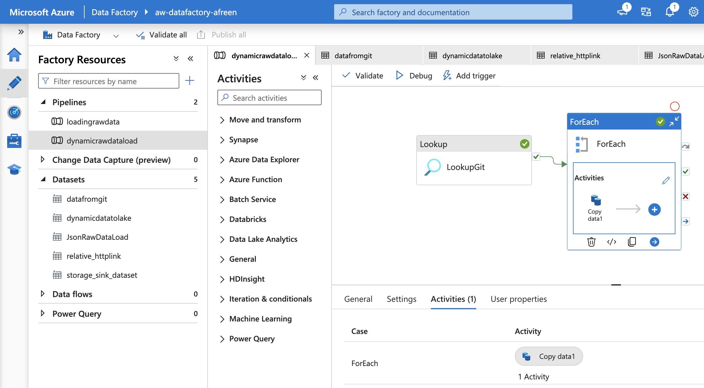
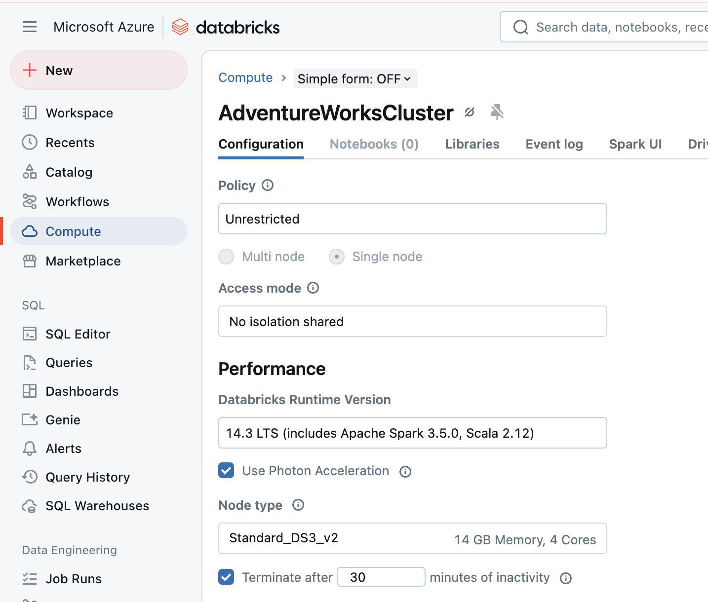

# 🚀 AdventureWorks Data Hub: End-to-End Azure Data Pipeline  

## 📌 Overview  
This project demonstrates an **end-to-end Data Engineering pipeline** on **Azure** using the **AdventureWorks dataset**. It integrates **Azure Data Factory, Azure Data Lake, Azure Databricks, and Azure Synapse Analytics** to build a **scalable ETL workflow** for data ingestion, transformation, and reporting.  

---

## **🛠 Architecture Diagram**  
  

---

## **📂 Dataset**  
Dataset used: [AdventureWorks Dataset](https://www.kaggle.com/datasets/ukveteran/adventure-works)  
It includes the following CSV files:  
📌 **Calendar, Customers, Products, ProductCategories, ProductSubcategories, Returns, Sales_2015, Sales_2016, Sales_2017, Territories**  

---

## **📌 Steps Implemented in the Project**  

### **1️⃣ Azure Resource Setup**  
🔹 Created an **Azure Resource Group** for the project.  
🔹 Provisioned required **Azure services**:  
   - **Azure Storage Account (Data Lake Gen2)**
   - **Azure Data Factory (ADF)**
   - **Azure Databricks**
   - **Azure Synapse Analytics**  
  

---

### **2️⃣ Data Ingestion (Bronze Layer)**
🔹 Configured **Azure Data Lake Gen2** and created three containers:  
   - **Bronze** → Raw Data  
   - **Silver** → Processed Data  
   - **Gold** → Ready-to-serve Data
  

🔹 **Azure Data Factory (ADF) Pipelines**:
   - Extracted dataset from GitHub to the Bronze Layer dynamically using HTTP API.  
   - Implemented **Lookup + ForEach + Copy Data** activities.  
   - Configured [JSON](./Scripts/DynamicRawDataLoad.json) with relative paths and filenames to automate ingestion.  
  

---

### **3️⃣ Data Transformation (Silver Layer - Azure Databricks)**
🔹 Created an Azure Databricks Workspace and configured:  
   - IAM Role as Storage Blob Data Contributor for accessing the Data Lake.  
   - Databricks Compute Cluster & [Notebook](./Scripts/aw_silver_layer.ipynb) for processing raw data using PySpark.
 

🔹 **Transformation Steps (PySpark - Databricks Notebook)**
   - Read raw data from Bronze Layer.  
   - Applied **data cleaning, type conversion, and feature engineering**.  
   - Saved transformed data as **Parquet files** in the Silver Layer.

📌 **Example Transformation (Calendar Table)**  

```python
df_cal = spark.read.format("csv")\
        .option("header", "true")\
        .option("inferSchema",True)\
        .load("abfss://bronze@awdatalakeafreen.dfs.core.windows.net/Calendar")

df_cal = df_cal.withColumn("Month", month(col("Date")))\
               .withColumn("Year", year(col("Date")))

df_cal.write.format('parquet')\
            .mode('append')\
            .option("path","abfss://silver@awdatalakeafreen.dfs.core.windows.net/Calendar")\
            .save()
```
---

### **4️⃣ Data Serving (Gold Layer - Azure Synapse)**  
🔹 Connected Azure Synapse Analytics to the Silver Layer using Managed Identity (IAM).  
🔹 Created Schemas, [Views](./Scripts/create_view_gold.sql), and [External Tables](./Scripts/external_table.sql) to serve the data efficiently.  

---

## **📌 Technologies Used**  
✅ **Cloud:** Azure (Data Factory, Synapse, Databricks, Storage)  
✅ **ETL & Orchestration:** Azure Data Factory, Apache Airflow  
✅ **Data Processing:** PySpark, SQL  
✅ **Data Storage:** Azure Data Lake Gen2 (Bronze, Silver, Gold layers)  
✅ **Data Warehousing:** Azure Synapse Analytics  

---

### **🚀 Conclusion**  
This project demonstrates an enterprise-level Data Engineering pipeline, leveraging Azure services for efficient data ingestion, transformation, storage, and analytics. It showcases end-to-end automation and scalability in cloud-based data pipelines.
